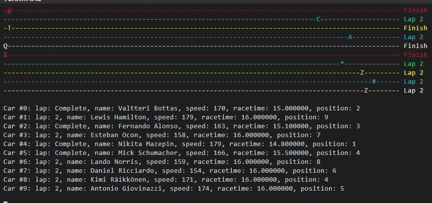

# Multithreaded Grand Prix Simulator - Using OpenMP with C

## Members

Kevin Contreras - A01635597

Luis Bodart - A01635000

Michel Lujano - A01636172

***

## Description

**A final project** for the class **Advance Programming** - **Period: Aug-Dec 2021**

This project implementes the API OpenMP using C which is able to run multithreads available upon to the machine running the method **omp_get_max_threads()** for the maximum value for cars where our output is visible in a CLI.

***

### Technical Features, Usage and Compilation/Run

Documentation: [GRAND_PRIX.md](./GRAND_PRIX.md)

***

### More files, resources and others
  
* Architecture document: [ARCHITECTURE.md](./ARCHITECTURE.md)
* Compilation, run and build: `Makefile`
* Documentation: [GRAND_PRIX.md](./GRAND_PRIX.md)
* Video: [YouTube](https://youtu.be/1ho_WDurcfo)